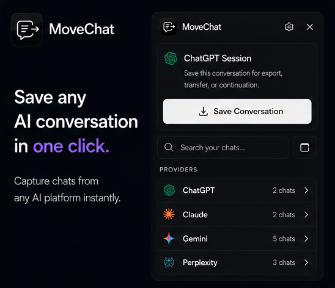

<h1 align="center">MoveChat</h1>

<p align="center">
  
</p>

<p align="center">
  <strong>Capture AI chat sessions and resume them in a new chat on any platform.</strong>
</p>

---

## The Problem

You're deep in a conversation on Claude but want to continue on ChatGPT. Or you hit a context limit and need to transfer your full history to a fresh chat. Currently, you'd have to manually copy-paste everything.

## What MoveChat Does

- **Capture** your full conversation (text, images, files) from any supported platform
- **Store** it locally in your browser — nothing leaves your device
- **Transfer** it to a new chat on any other platform with a single click

## Supported Platforms

| Platform | Capture | Resume |
|----------|---------|--------|
| ChatGPT | ✅ | ✅ |
| Claude | ✅ | ✅ |
| Gemini | ✅ | ✅ |
| Perplexity | ✅ | ✅ |

## Installation

### From Chrome Web Store

<!-- Update this link once published -->

> Not yet published. Coming soon.

### From Source

1. Clone the repo

   ```bash
   git clone https://github.com/VC067/MoveChat.git
   ```

2. Install dependencies

   ```bash
   npm install
   ```

3. Build the extension

   ```bash
   npm run build
   ```

4. Open `chrome://extensions` in your browser
5. Enable **Developer mode** (toggle in top right)
6. Click **Load unpacked** and select the `dist/` folder

The MoveChat icon should now appear in your browser toolbar.

## Development

```bash
npm run dev
```

Then reload the extension in `chrome://extensions` to pick up changes. Or use Vite's dev mode with HMR.

### Commands

| Command | Description |
|---------|-------------|
| `npm run dev` | Start Vite dev server |
| `npm run build` | Build for production (TypeScript + Vite) |
| `npm run lint` | Run ESLint |

## Architecture

```
src/
├── popup/                  # Extension popup UI (React + Tailwind)
│   ├── components/
│   │   ├── Header.tsx
│   │   ├── LibraryView.tsx
│   │   ├── PlatformLogo.tsx
│   │   ├── SessionDetailView.tsx
│   │   └── SettingsView.tsx
│   └── hooks/
│       └── useStorage.ts
├── content/                # Content scripts
│   ├── scrapers/           # Extract conversations from each platform
│   ├── injectors/          # Paste conversations into target platforms
│   ├── dom.ts              # DOM utilities
│   ├── index.ts            # Content script entry point
│   └── storage.ts          # Storage helpers
├── background/
│   └── index.ts            # Service worker (navigation + image fetch)
└── shared/
    ├── types.ts            # TypeScript interfaces
    ├── storage.ts          # Chrome storage abstraction
    ├── compress.ts         # AI-powered conversation compression
    ├── markdown.ts         # Markdown export
    └── pdf.ts              # PDF export
```

### How It Works

1. **Capture:** When you click "Capture this session," the popup sends a message to a content script running on the active tab. The scraper reads the DOM, extracts messages and images, and sends them back.

2. **Store:** Conversations are saved to `chrome.storage.local` as structured JSON.

3. **Resume:** When you click "Resume in new chat," the extension opens a new tab on the target platform and injects the conversation history via a content script.

## Permissions

MoveChat requests the following permissions:

| Permission | Why |
|-----------|-----|
| `activeTab` | Access the current tab to capture conversations |
| `storage` | Store conversations, settings, and API keys locally |
| `tabs` | Open new tabs when resuming on another platform |
| `scripting` | Dynamically inject content scripts |
| `*://*/*` | Fetch images from third-party CDNs embedded in conversations |

See [docs/privacy.html](https://vc067.github.io/MoveChat/privacy) for our full privacy policy.

## Privacy

- All data stays on your device (`chrome.storage.local`)
- No analytics, no tracking, no remote servers
- API keys are stored locally and sent only to your chosen provider

See [docs/privacy.html](https://vc067.github.io/MoveChat/privacy) for our full privacy policy.

## Contributing

This project is not accepting code contributions at this time.

If you find a bug or have a feature idea, please open an [issue](https://github.com/VC067/MoveChat/issues).

## License

[MIT](LICENSE) — see [LICENSE](LICENSE) for details.
