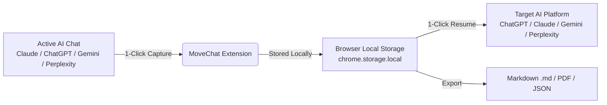

<div align="center">

  # 🚀 MoveChat
  ### **Seamlessly Transfer, Export, and Resume AI Conversations Across Platforms**

  <br/>

  <p align="center">
    
  </p>

  <br/>

  <p align="center">
    <a href="public/manifest.json"></a>&nbsp;
    <a href="https://chromewebstore.google.com/detail/cgpfngggfccdpjppachknliainihkbdg?utm_source=item-share-cb"></a>&nbsp;
    <a href="https://addons.mozilla.org/en-US/firefox/addon/movechat/"></a>&nbsp;
    <a href="LICENSE"></a>&nbsp;
    <a href="public/manifest.json"></a>&nbsp;
    
  </p>

  <p align="center">
    <strong>Ever got stuck in a long Claude thread and wished you could instantly jump to ChatGPT, Gemini, or Perplexity without losing text, code blocks, images, or attached files?</strong><br/>
    MoveChat is a free, 100% open-source, privacy-first Chrome extension that lets you capture, transfer, and export your AI chats in 1-click.
  </p>

  <p align="center">
    <a href="https://chromewebstore.google.com/detail/cgpfngggfccdpjppachknliainihkbdg?utm_source=item-share-cb">
      
    </a>
  </p>

</div>

---

## ⭐ Give Us A Star!

If MoveChat helps you switch between AI platforms effortlessly, **please consider giving this repository a ⭐ star!** It helps other developers and AI users discover this open-source tool.

---

## ✨ Why MoveChat?

| Feature | Description |
| :--- | :--- |
| ⚡ **1-Click Seamless Transfer** | Capture chat threads on one AI platform and resume them instantly on another without losing context. |
| 🔒 **100% Local & Safe** | All data stays strictly in your browser (`chrome.storage.local`). Zero tracking, zero telemetry, zero external servers. |
| 🖼️ **Full Media & File Support** | Automatically extracts code blocks, inline images, generated artifacts, and attached documents during handoff. |
| 📄 **Multi-Format Export** | Export any AI conversation to **Markdown (`.md`)**, **PDF**, or raw **JSON** for offline notes & documentation. |
| 🧠 **Optional AI Compression** | Summarize long, verbose chat histories using your own API key (OpenAI / Anthropic / Gemini) before transferring. |
| 🛡️ **Manifest V3 Compliant** | Built adhering strictly to Chrome Web Store MV3 security, privacy, and performance guidelines. |

---

## 🌐 Supported Platforms

MoveChat offers full bidirectional capture and handoff across all major AI chat platforms:

| Platform | Capture Session | Resume Chat | Images & Media | File Attachments |
| :--- | :---: | :---: | :---: | :---: |
| **ChatGPT** (`chatgpt.com`) | ✅ | ✅ | ✅ | ✅ |
| **Claude** (`claude.ai`) | ✅ | ✅ | ✅ | ✅ |
| **Gemini** (`gemini.google.com`) | ✅ | ✅ | ✅ | ✅ |
| **Perplexity** (`perplexity.ai`) | ✅ | ✅ | ✅ | ✅ |

---

## 🚀 How It Works


```mermaid
graph LR
    A[Active AI Chat<br/>Claude / ChatGPT / Gemini / Perplexity] -->|1-Click Capture| B(MoveChat Extension)
    B -->|Stored Locally| C[Browser Local Storage<br/>chrome.storage.local]
    C -->|1-Click Resume| D[Target AI Platform<br/>ChatGPT / Claude / Gemini / Perplexity]
    C -->|Export| E[Markdown .md / PDF / JSON]
```

1. **Capture**: Click **"Capture this session"** in the MoveChat popup while viewing an active conversation. MoveChat safely reads the thread, extracting text, code blocks, images, and attachments.
2. **Store**: Conversations are saved locally on your device in structured JSON format. You can search, review, or organize your session library anytime.
3. **Resume**: Select any target AI platform and click **"Resume in new chat"**. MoveChat automatically opens the target platform, populates the prompt, attaches your files/images, and lets you continue where you left off.

---

## 📦 Installation

### Option 1: Chrome Web Store (Recommended)

Get MoveChat directly from the official Chrome Web Store:

👉 **[Install MoveChat from Chrome Web Store](https://chromewebstore.google.com/detail/cgpfngggfccdpjppachknliainihkbdg?utm_source=item-share-cb)**

---

### Option 2: Build & Load from Source (Developer Mode)

1. **Clone the repository:**
   ```bash
   git clone https://github.com/VC067/MoveChat.git
   cd MoveChat
   ```

2. **Install dependencies:**
   ```bash
   npm install
   ```

3. **Build the production extension:**
   ```bash
   npm run build
   ```

4. **Load into Google Chrome:**
   - Open `chrome://extensions` in your browser.
   - Enable **Developer mode** (toggle switch in top right corner).
   - Click **Load unpacked** and select the generated `dist/` directory.

---

## 🛠️ Development & Scripts

```bash
# Start Vite development server
npm run dev

# Type-check and build production bundle (outputs to /dist)
npm run build

# Lint source files
npm run lint
```

---

## 🏗️ Project Architecture

```
MoveChat/
├── src/
│   ├── popup/                  # Extension Popup UI (React + Tailwind CSS)
│   │   ├── components/         # Header, LibraryView, SessionDetailView, SettingsView, etc.
│   │   └── hooks/              # Custom Chrome Storage Hooks
│   ├── content/                # Content Scripts (Runs on AI web apps)
│   │   ├── scrapers/           # ChatGPT, Claude, Gemini & Perplexity scrapers
│   │   ├── injectors/          # Prompt & file injectors for each target platform
│   │   ├── dom.ts              # DOM parsing & HTML-to-Markdown converter
│   │   ├── index.ts            # Content script entry point & message listener
│   │   └── storage.ts          # Content script storage helper
│   ├── background/             # Service Worker (Tab navigation & CORS image proxy)
│   │   └── index.ts
│   └── shared/                 # Core Utilities & Types
│       ├── types.ts            # Data interfaces (Session, Message, AttachedFile)
│       ├── storage.ts          # Chrome storage wrapper
│       ├── markdown.ts         # Markdown exporter
│       ├── pdf.ts              # PDF exporter (jsPDF)
│       └── compress.ts         # Optional AI summary/compression engine
└── public/
    └── manifest.json           # Chrome Manifest V3 configuration
```

---

## 🛡️ Privacy, Safety & Permissions

MoveChat is engineered with a strict **privacy-first principle**:

- 🔒 **Zero Remote Analytics or Tracking**: We do not collect, track, or transmit any user data.
- 💾 **100% On-Device Storage**: All captured sessions, images, settings, and optional API keys remain inside `chrome.storage.local`.
- 🔐 **Scoped Host Permissions**: Host permissions are strictly restricted to supported AI web domains (`chatgpt.com`, `claude.ai`, `gemini.google.com`, `perplexity.ai`) and necessary image CDNs (`*.googleusercontent.com`, `*.oaiusercontent.com`).

| Permission | Purpose |
| :--- | :--- |
| `activeTab` | Read conversation elements on the active tab when requested by the user |
| `storage` | Store chat sessions, settings, and exports locally on your machine |
| `tabs` | Open a new tab when resuming conversations on another platform |
| `scripting` | Inject content scripts for chat scraping and prompt injection |

For complete details, view our [Privacy Policy](https://vc067.github.io/MoveChat/privacy).

---

## 📄 License

Distributed under the **MIT License**. See [`LICENSE`](LICENSE) for details.

---

<div align="center">

  ### **Enjoying MoveChat? Don't forget to ⭐ star the repository!**

  [Report Bug](https://github.com/VC067/MoveChat/issues) · [Request Feature](https://github.com/VC067/MoveChat/issues)

</div>
